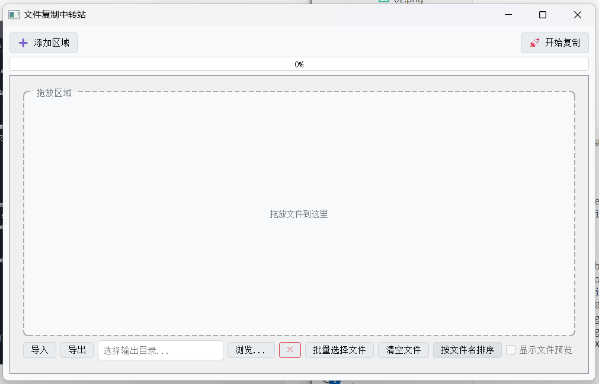

# 文件复制工具




## 一、概述
这是一个基于 Python 和 PyQt5 开发的文件复制工具，具备直观的图形用户界面（GUI）。它允许用户通过简单的拖放操作选择要复制的文件，并将其复制到指定的输出文件夹。工具支持动态调整拖入区域数量，采用多线程技术进行文件复制以提升效率，同时能够处理重名文件，还会实时显示复制进度。

## 二、功能特性
### （一）多拖入区域管理
- 支持动态添加和删除拖入区域。用户可以根据需要，通过点击 “➕ 添加区域” 按钮来增加拖入区域；点击每个区域的 “×” 删除按钮，可移除对应的拖入区域。
- 每个拖入区域都有独立的输出文件夹设置，方便同时管理多组不同的文件复制任务。

### （二）多线程复制
- 运用多线程技术进行文件复制，大大提高了复制效率，尤其适用于处理大量文件的复制任务。

### （三）重名文件处理
- 在复制过程中，如果遇到重名文件，系统会自动在文件名后添加 6 位随机字母和数字，确保复制后的文件名具有唯一性。

### （四）实时进度显示
- 复制过程中，进度条会实时显示复制进度，同时还会显示剩余时间和复制速度，让用户清晰了解复制任务的执行情况。


## 三、打包方法
若要将该 Python 脚本打包成可执行的 `.exe` 文件，可以使用 `PyInstaller` 工具。在命令行中执行以下命令：

```bash
pyinstaller --onefile --windowed --icon=app.ico DropCopy.py
```
