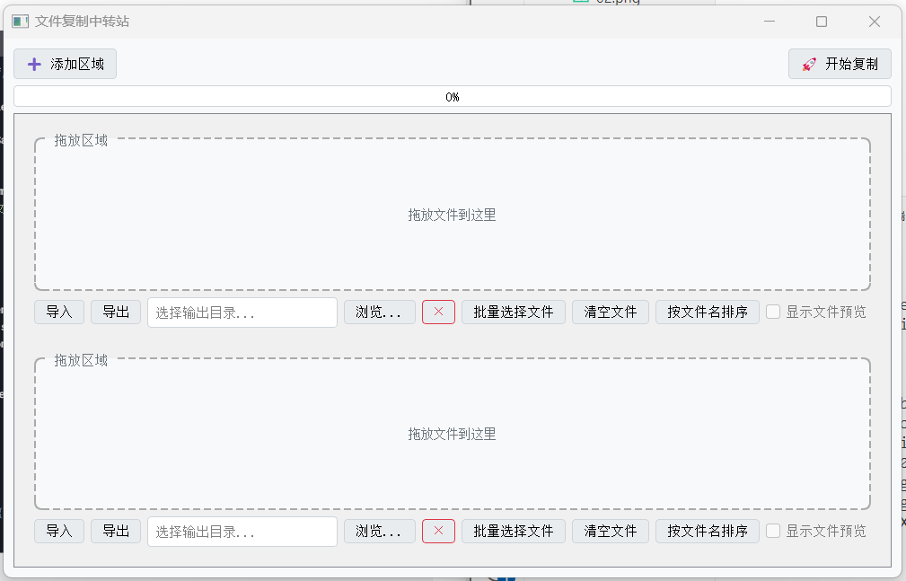

# 文件复制工具




## 一、概述
这是一个基于 Python 和 PyQt5 开发的文件复制工具，具备直观的图形用户界面（GUI）。它允许用户通过简单的拖放操作选择要复制的文件，并将其复制到指定的输出文件夹。工具支持动态调整拖入区域数量，采用多线程技术进行文件复制以提升效率，同时能够处理重名文件，还会实时显示复制进度。

## 二、功能特性
### （一）多拖入区域管理
- 支持动态添加和删除拖入区域。用户可以根据需要，通过点击 “➕ 添加区域” 按钮来增加拖入区域；点击每个区域的 “×” 删除按钮，可移除对应的拖入区域。
- 每个拖入区域都有独立的输出文件夹设置，方便同时管理多组不同的文件复制任务。

### （二）便捷的文件选择
- 采用拖放式操作，用户只需将文件直接拖到相应的拖入区域，即可快速选择要复制的文件。
- 支持一次性拖入多个文件，系统会自动过滤掉无效文件，并弹出警告框告知用户。

### （三）多线程复制
- 运用多线程技术进行文件复制，大大提高了复制效率，尤其适用于处理大量文件的复制任务。

### （四）重名文件处理
- 在复制过程中，如果遇到重名文件，系统会自动在文件名后添加 6 位随机字母和数字，确保复制后的文件名具有唯一性。

### （五）实时进度显示
- 复制过程中，进度条会实时显示复制进度，同时还会显示剩余时间和复制速度，让用户清晰了解复制任务的执行情况。

### （六）错误处理与提示
- 当遇到无效文件、输出路径未设置、无法创建目录等问题时，系统会弹出相应的提示框，告知用户具体的错误信息，方便用户及时处理。

### （七）自定义图标
- 程序拥有自定义的窗口图标和任务栏图标（`app.ico`），提升了用户体验和程序的辨识度。

## 三、使用步骤
### （一）启动程序
运行打包后的 `.exe` 文件或者直接运行 Python 脚本，即可打开文件复制工具。

### （二）设置输出文件夹
- 点击每个拖入区域下方的 “浏览...” 按钮。
- 在弹出的文件选择对话框中，选择文件复制的目标输出文件夹。

### （三）选择要复制的文件
将需要复制的文件直接拖放到相应的拖入区域。若拖入无效文件，系统会弹出警告框提示。

### （四）开始复制
确认文件和输出文件夹设置无误后，点击 “🚀 开始复制” 按钮，程序将开始多线程复制文件。

### （五）查看进度
在复制过程中，进度条会实时更新复制进度、剩余时间和复制速度。

### （六）完成处理
- 复制完成后，系统会弹出提示框，告知复制结果（包括成功复制的文件数量和失败的文件数量，若有失败情况还会显示部分错误详情）。
- 拖入区域的文件选择会被清空，但输出文件夹路径会保留，方便用户进行下一轮复制操作。

## 四、注意事项
### （一）图标文件
确保 `app.ico` 文件与程序文件处于同一目录下，或者根据实际情况修改代码中的图标路径。

### （二）权限问题
若在选择输出文件夹时遇到权限问题，可能导致文件夹无法创建或写入，请确保程序具有相应的操作权限。

### （三）资源占用
对于大量文件的复制任务，多线程复制会提高效率，但可能会占用较多系统资源，请根据实际情况进行操作。

## 五、打包方法
若要将该 Python 脚本打包成可执行的 `.exe` 文件，可以使用 `PyInstaller` 工具。在命令行中执行以下命令：

```bash
pyinstaller --onefile --windowed --icon=app.ico DropCopy.py
```
